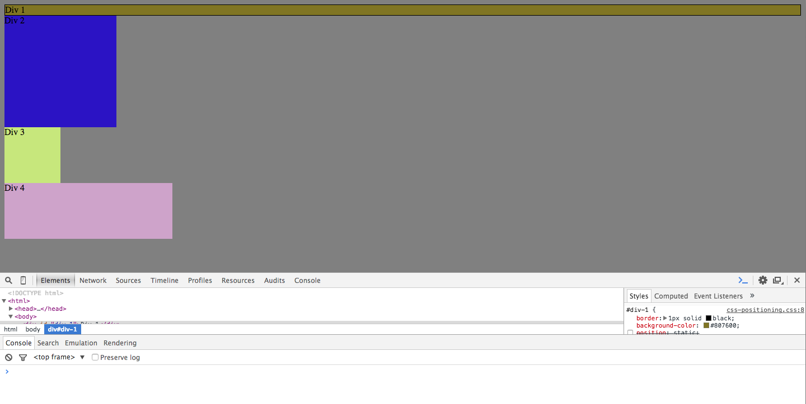
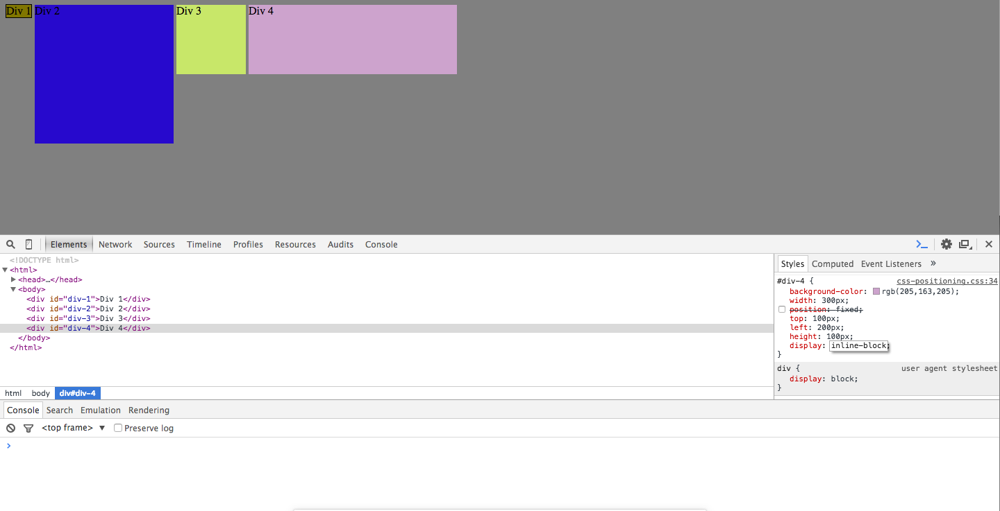
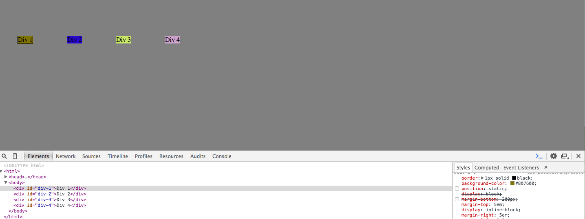
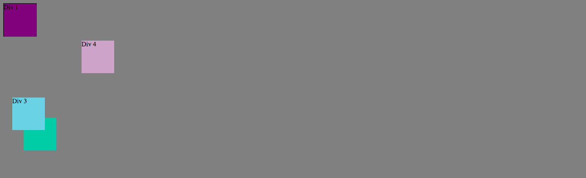
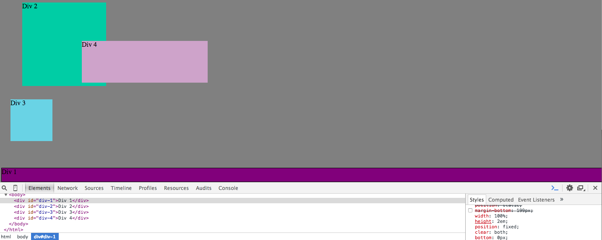
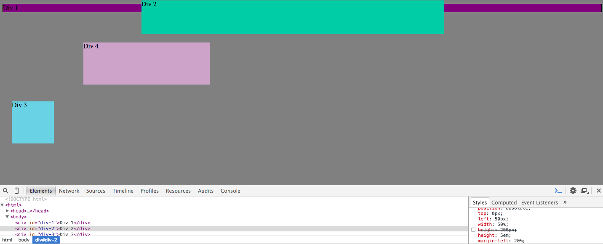
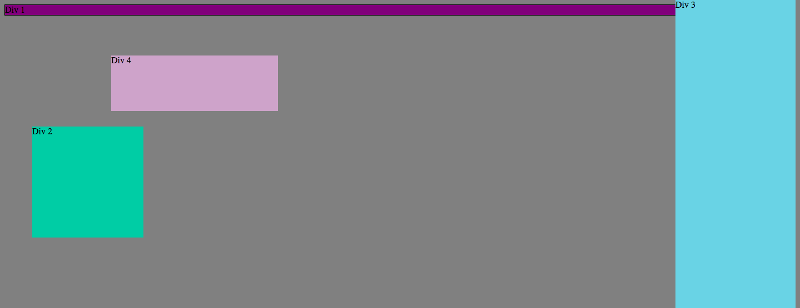

##How can you use Chrome's DevTools inspector to help you format or position elements?

(1) You can select to turn objects on or off, displaying their function in the browser (or on the page)
(2) Side by side dev window and site window allows us to see the coding as it takes place.

##How can you resize elements on the DOM using CSS?

We resized div's using height and width, but also manipulated size with directional properties like top & bottom as well as adjusting the margins

##What are the differences between Absolute, Fixed, Static, and Relative positioning? Which did you find easiest to use? Which was most difficult?

Absolute was best for items that were going to be stacked on each other.

Relative was the best for when items on were not going to be stacked on each other ( I found this the easiest to use)

Fixed: anchors item to browsing window
vs
Static: anchors item to page

[Note:Nothing was too difficult to use]

##What are the differences between Margin, Border, and Padding?

Margin: dictates how far from the edge of the page you want an item to be.
Border: edge of element (b/w margin and padding)
Padding: Space between content and border

##What was your impression of this challenge overall? (love, hate, and why?)

It's a chance to be more creative and execute problem solving.  Sure, it was a bit tedious, but isn't that programming in general.  I'm looking forward to working this CSS muscle more and see how creative I can get with it.