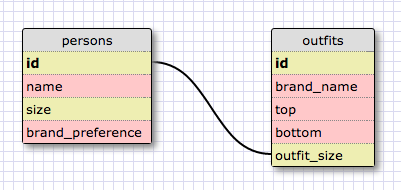

#1. Select all data for all states. -->
SELECT * FROM states;

#2. Select all data for all regions. -->
SELECT * FROM regions;

#3. Select all data for all regions. -->
SELECT state_name, population FROM states;

#4. Select the state_name and population for all states ordered by population. The state with the highest population should be at the top. -->

SELECT state_name, population FROM states
ORDER BY population DESC;

#5. Select the state_name for the states in region 7.-->
SELECT state_name FROM states
WHERE region_id == 7;

#6. Select the state_name and population_density for states with a population density over 50 ordered from least to most dense. -->
SELECT state_name, population_density FROM states
WHERE population_density > 50
ORDER BY population_density ASC;

#7.Select the state_name for states with a population between 1 million and 1.5 million people. -->

SELECT state_name FROM states
WHERE population BETWEEN 1000000 AND 1500000;

#8. Select the state_name and region_id for states ordered by region in ascending order.-->

SELECT state_name, region_id FROM states
ORDER BY region_id ASC;

#9. Select the region_name for the regions with "Central" in the name. -->

SELECT region_name FROM regions
WHERE region_name LIKE "%CENTRAL%";

#10. Select the region_name and the state_name for all states and regions in ascending order by region_id. Refer to the region by name. (This will involve joining the tables).-->

SELECT region_name, state_name
FROM regions, states
ORDER BY region_id ASC;

##REFLECTION
(1) What are databases for?
For organizing and sorting data, being able to relate information as needed

(2) What is a one-to-many relationship?
One row in a table can be related to many rows in another

(3) What is a primary key? What is a foreign key? How can you determine which is which?
A primary key is sort of like a hash key, in that it is a unique value.  A foreign key links to a primary key in another table and is a primary key in its own table.  You can determine which is which by simple relativity

(4)How can you select information out of a SQL database? What are some general guidelines for that?
You use call functions like SELECT, WHERE, FROM, etc. to call rows, columns, and mutiple tables.  As for general guidelines, well, I think I can say remember proper punctuation and use SELECT * FROM table_name as a console.log and use that first to see what you can be manipulating in the table.  Look for something that can be DRY-ed up and seek out information that can be linked (primary/foreign), like one-to-many relationships.  Capitalize commands, keep headers all lower.